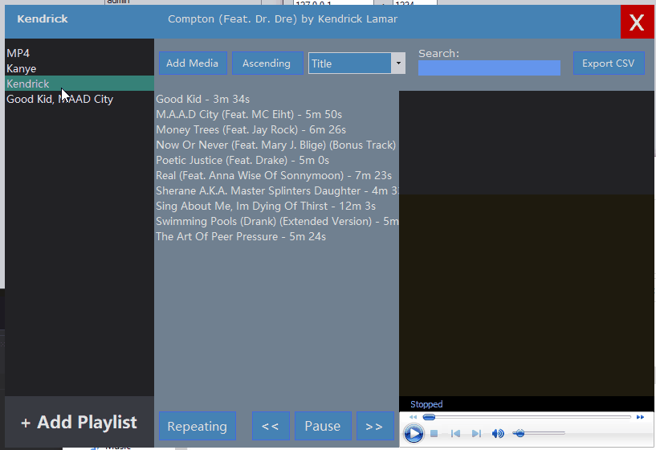
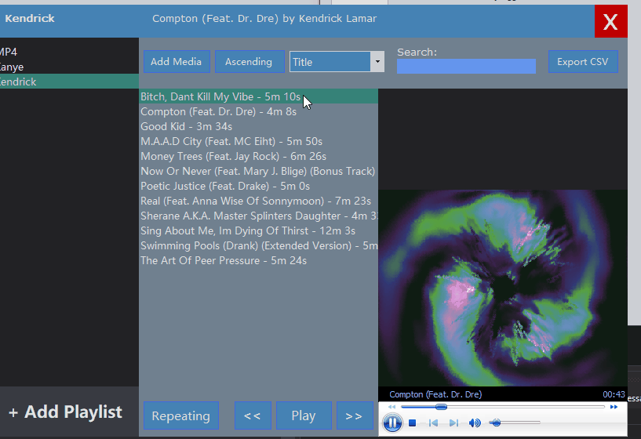
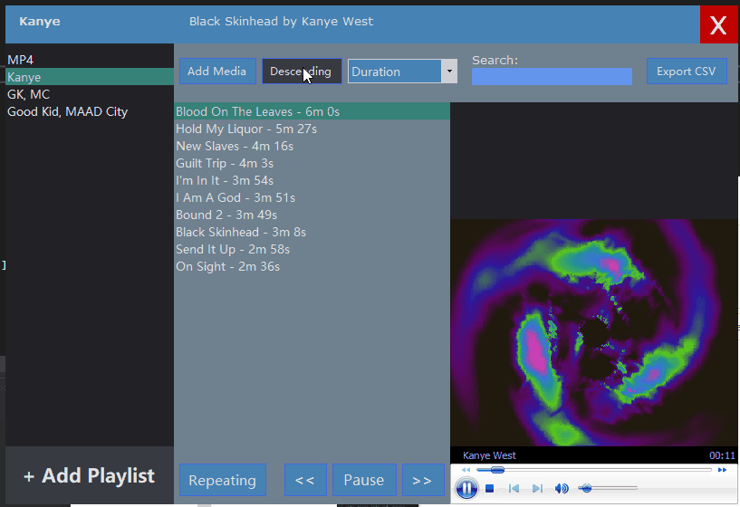
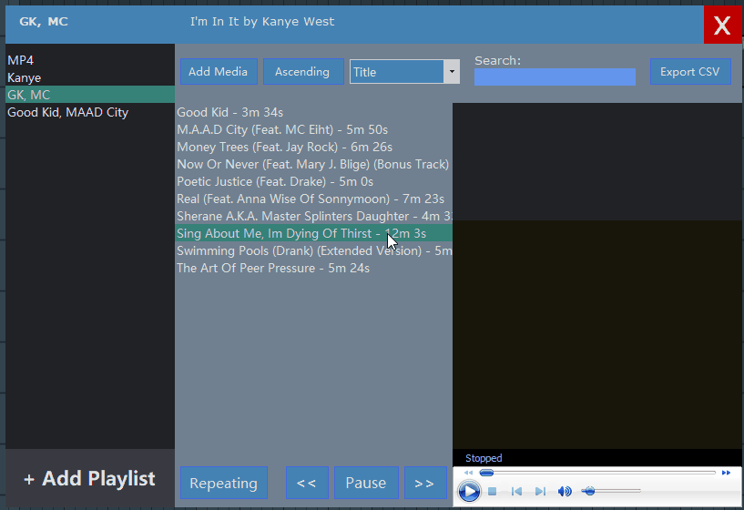

# Screen Captured Tests

**Figure 1 - song queue, history stack**

**Figure 2 - queue songs between playlists**

**Figure 3 - new playlist, edit playlist**

**Figure 4 - Removing songs from playlist**

**Figure 5 - sorting by Title or Duration**

**Figure 6 - altering data, then viewing CSV spreadsheet**
